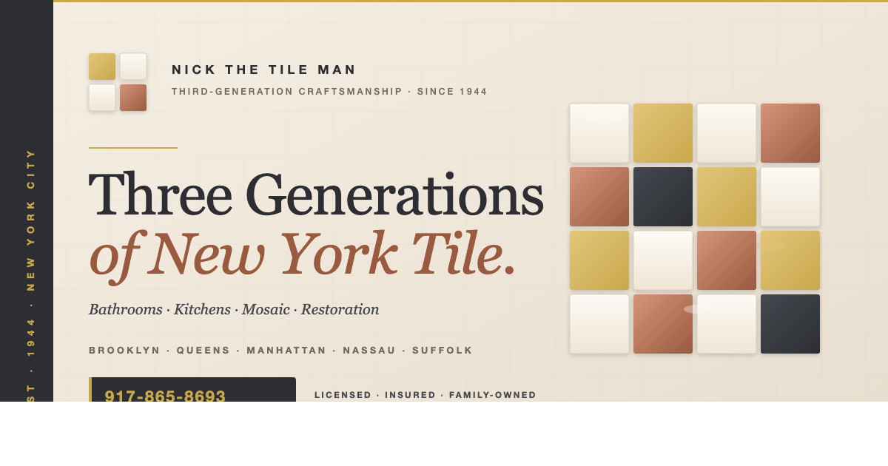

<div align="center">



# Nick the Tile Man

**Third-Generation NYC Tile Installation & Repair**
Brooklyn · Queens · Manhattan · Nassau · Suffolk

[](https://nickthetileman.vercel.app)
[](tel:+19178658693)
[](#)

</div>

---

## About

A mobile-first, single-page marketing site for a third-generation New York tile craftsman. Built as a single self-contained `index.html` — no build step, no framework, no dependencies. Designed for fast loads on older phones and zero-friction lead capture (call, text, photo upload).

## Live

**Production:** https://nickthetileman.vercel.app

## Stack

- **Single-file HTML** — ~1,400 lines, inlined CSS + JS
- **Hosting** — Vercel static (immutable cache on `/assets/*`)
- **Fonts** — Cormorant Garamond (display), DM Sans (body), Bebas Neue (eyebrows)
- **Imagery** — 48 portfolio photos, JPEG-optimized, two sizes (720px thumbs / 1600px gallery)
- **No build pipeline** — open `index.html` and ship it

## Features

- Editorial hero with snap-in tile motif
- Filterable portfolio gallery (All · Bathroom · Kitchen · Floor · Mosaic) — masonry layout, lightbox
- Interactive Tile Pattern Builder (HTML Canvas) — upload your own texture, drag/drop tiles
- Hand-written letter modal — Nick's personal note in vintage paper aesthetic
- Service area grid with "select areas" badges for Brooklyn, Manhattan & Suffolk
- Sticky CTA bar — call & free-estimate buttons always reachable
- Click-to-call · SMS · contact form with photo upload
- Mobile-first responsive (320px → 1440px+)
- Full Open Graph + Twitter Card metadata for share previews
- Inlined SVG favicon + Apple touch icon

## Project Structure

```
NickTheTileMan/
├── index.html              # the entire site
├── vercel.json             # static config + cache headers
├── assets/
│   ├── og-banner.png       # social share preview (1200×630)
│   ├── og-banner.svg       # editable banner source
│   ├── gallery/            # full-size portfolio photos (1600px)
│   └── thumbs/             # gallery thumbnails (720px)
└── README.md
```

## Deploy

### Vercel
```bash
git push                    # auto-deploys via GitHub integration
```
Or one-shot:
```bash
npx vercel --prod
```

### Any static host
Upload the directory. `vercel.json` is Vercel-specific and harmless elsewhere.

## Contact

**Nick** — third-generation tile installer
📞 [917-865-8693](tel:+19178658693)
🌐 [nickthetileman.vercel.app](https://nickthetileman.vercel.app)

---

<div align="center">
<sub>Built with care · NYC · 1944 → present</sub>
</div>
